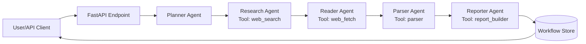

# 🚀 AI Agent Demo — Portfolio-Grade FastAPI Multi-Agent Orchestration

[](./.github/workflows/ci.yml)
[](./pyproject.toml)
[](./Dockerfile)

> A production-style FastAPI project that runs a **real multi-agent workflow** with **real tool-calling** (web search + page fetch + parsing + report generation).

## Hero

Transform a user objective into a structured research brief with citations in one API call.

```json
POST /v1/research/workflows
{
  "query": "FastAPI for multi-agent orchestration",
  "max_results": 5,
  "max_sources_to_read": 3
}
```

Returns:
- full execution trace (`tool_calls`)
- parsed source notes
- final markdown report

## Architecture



## Quickstart (3 commands)

```bash
python -m venv .venv && source .venv/bin/activate
pip install -e .[dev]
uvicorn ai_agent_demo.main:app --reload
```

Open: `http://127.0.0.1:8000/docs`

## API

- `GET /health`
- `POST /v1/research/workflows`
- `GET /v1/research/workflows/{workflow_id}`

## Local quality gate

```bash
ruff check .
pytest -q
docker build -t ai-agent-demo:local .
```

## Docker

Run with compose:

```bash
docker compose up --build
```

## Project structure

```text
src/ai_agent_demo/
  main.py
  orchestrator.py
  tools.py
  models.py
  storage.py
tests/
docs/
.github/workflows/
```

## Notes

- Micro health/status endpoint sprawl removed.
- API consolidated around a real business use case: research workflow execution.
- Tests validate orchestration logic and integration behavior, not only status codes.
