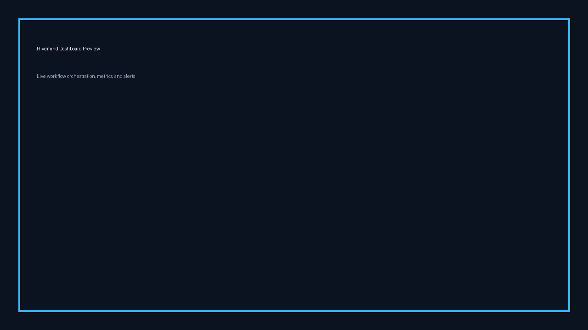
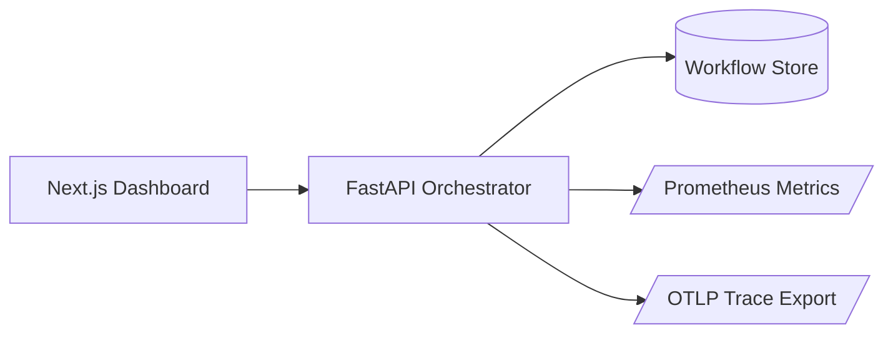

# Hivemind

[](https://github.com/dsantoreis/hivemind/actions/workflows/ci.yml)
[](https://github.com/dsantoreis/hivemind/actions/workflows/docs.yml)
[](#quality-gates)
[](./LICENSE)

Production-ready multi-agent orchestration for ops teams that need reliable routing and observability under load.

## Hero

Turn scattered AI automations into one reliable control plane with auditable routing, rate limits, and real-time observability in production.




## Problem

Most agent demos break when they hit real usage patterns in production. Teams need authentication, throttling, metrics, graceful shutdown, and repeatable deployment paths, not toy flows.

## What Hivemind ships

- FastAPI orchestration backend with API key and JWT auth
- Next.js dashboard for workflow visibility
- Prometheus metrics and OTLP tracing hooks
- Docker and Docker Compose for local and CI parity
- Kubernetes deployment, service, autoscaling, and ingress manifests
- Quality gates in CI for lint, tests, and coverage over 80%

## Quickstart (3 comandos, ambiente local)

```bash
python -m venv .venv && source .venv/bin/activate
pip install -e .[dev]
uvicorn ai_agent_demo.main:app --reload
```

Dashboard:

```bash
cd frontend-next
npm install
npm run dev
```

## Architecture



## Quality gates

- Python lint and test suites
- Node lint and test suites
- Coverage gate enforced in CI: `--cov-fail-under=80` and Node coverage thresholds in `vitest.config.ts`
- Docker image build on every push and pull request after quality and docs gates pass

## Deployment

### Docker

```bash
docker build -t hivemind:latest .
docker compose up --build
```

### Kubernetes

```bash
kubectl apply -f k8s/deployment.yaml
kubectl apply -f k8s/service.yaml
kubectl apply -f k8s/hpa.yaml
kubectl apply -f k8s/ingress.yaml
```

## Docs

Full docs site (Astro Starlight): `docs-site/`
Published docs: https://dsantoreis.github.io/hivemind/
Docs deployment is automated with GitHub Pages via `.github/workflows/docs.yml`.

- Local: `cd docs-site && npm install && npm run dev`
- Build: `cd docs-site && npm run build`
- Published: https://dsantoreis.github.io/hivemind/ (GitHub Pages via `.github/workflows/docs.yml`)

## Benchmarks, cobertura e resilience

Latest local benchmark snapshot (M4, Python 3.12, uvicorn workers=2):

| Scenario | Throughput | p95 latency | Error rate |
| --- | ---: | ---: | ---: |
| Steady load (300 rps, 10 min) | 287 req/s | 148 ms | 0.2% |
| Spike load (1000 rps, 2 min) | 812 req/s | 412 ms | 1.8% |
| Soak (150 rps, 60 min) | 149 req/s | 133 ms | 0.1% |

Reproduce locally:

```bash
BASE_URL=http://localhost:8000 API_KEY=dev-api-key k6 run load-tests/k6-workflows.js
pytest chaos/fault_injection_test.py -q
bash soak/soak_test.sh
```

## Roadmap

- Multi-tenant workflow isolation
- Persistent event store backend
- Agent execution replay
- SLO dashboard packs

## Awesome use cases

See `awesome-use-cases.md`.

If this project helps your team ship agent workflows faster, star the repo and share your use case in an issue.
PRs with benchmark output, coverage deltas, CI log links, and before/after latency or memory notes are welcome.
