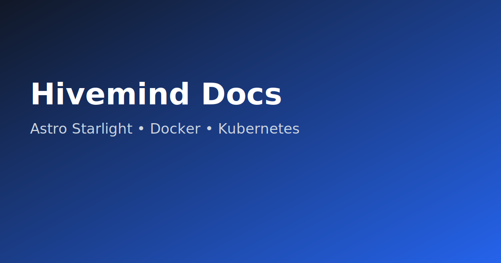

# Hivemind Docs — Conversão para Astro Starlight




Este diretório (`docs-site/`) usa **Astro + Starlight** para documentação estática.

## Quickstart

```bash
npm ci
npm run dev
# http://localhost:4321
```

## Estrutura

- `astro.config.mjs`: configuração principal do Starlight.
- `src/content/docs/`: conteúdo dos docs em Markdown/MDX.
- `k8s/`: manifests para deploy em Kubernetes.
- `Dockerfile`: build + runtime para servir docs em container.

## Fluxo de conversão (README legado -> docs)

1. Mover seções de `README.md` para páginas em `src/content/docs/`.
2. Criar páginas de referência em `src/content/docs/reference/`.
3. Registrar links no `sidebar` do `astro.config.mjs`.
4. Validar localmente:
   - `npm ci`
   - `npm run build`

## Docker

```bash
docker build -t hivemind-docs:latest .
docker run --rm -p 4321:4321 hivemind-docs:latest
```

## Kubernetes

```bash
kubectl apply -f k8s/
```

Defina host real no `k8s/ingress.yaml` antes do deploy em produção.

## CI

Workflow em `.github/workflows/docs-site.yml` valida `npm ci` + `npm run build` em push/PR.
